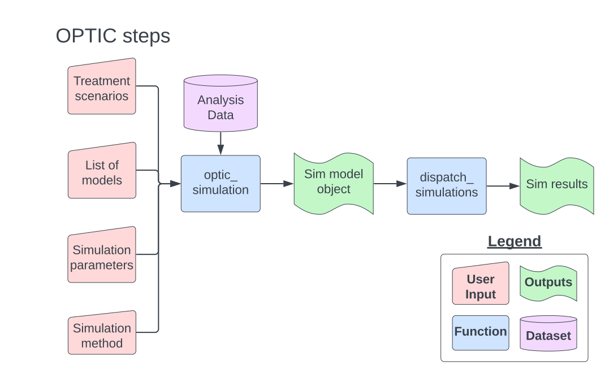

```{r, include = FALSE}
knitr::opts_chunk$set(
  collapse = TRUE,
  comment = "#>"
)
```


```{r setup, include=FALSE}

library(optic)

knitr::opts_chunk$set(echo = TRUE)

# this tidy option might be an issue.
knitr::opts_chunk$set(tidy.opts = list(width.cutoff = 60))

```

# Introduction {.unnumbered}

This vignette covers the use of the Opioid Policy Tools and Information Center (OPTIC) simulation package, which contains tools to simulate treatment effects into panel data or repeated measures data and examine the performance of commonly-used statistical models. Briefly, OPTIC uses Monte Carlo simulations to estimate the performance of models typically used for state-level policy evaluation (for example, differences-in-differences estimators). Package users provide the simulation procedure with a policy evaluation scenario, a hypothetical treatment effect, an estimation approach, and simulation parameters. The OPTIC package then constructs simulations for all chosen simulation parameters and estimators, returning summary statistics on each simulation's performance.

Currently, OPTIC has been developed for policy evaluation scenarios with
the following assumptions:

1.  **No confounding** : There are no confounding variables which determine
    an observations's selection into treatment. Treatment effects are assumed to be constant rather than time-varying.
2.  **Concurrent policies**: There is one additional policy which co-occurs with the policy of-interest. 
3.  **Confounding**: There is a confounding variable associated with both policy adoption and outcome *trends*.


Additional details on the simulation procedures within the OPTIC package are
available in @griffinMovingClassicDifferenceindifferences2021 and @griffinMethodologicalConsiderationsEstimating2023. Forthcoming updates to OPTIC will provides simulations which test the effect of confounding bias on model performance.

This README covers the use of OPTIC in R and provides examples of the
package's features. Section one covers package installation, section two
provides a general overview of the package's usage, and section three
provides two examples of the package under the different policy scenarios described above.

# Installation

From an R session, install the package from CRAN with:

```r
install.packages("optic")
```
Or from github:

```r
# Install remotes if necessary
# install.packages("remotes")
remotes::install_github("RANDCorporation/optic")
```

# Overview of the OPTIC Package

OPTIC contains two core functions for performing simulations, which
require four user-provided inputs. Figure 1 below displays a flowchart
of OPTIC's required steps to produce simulation results.

<center>
{width=90%}
</center>

The following sections describe OPTIC inputs and steps in detail.

## User inputs

### Data

Analysts will need to shape their data to work properly with OPTIC. The
package contains an example dataset which demonstrates the format
required by the function `optic_simulation`.

```{r example_data, echo = FALSE}
knitr::kable(overdoses[c(1:3, 20:22),], format = "markdown")
```

The data should generally be structured to work as an input to a two-way
fixed effect model, using a "long-format", with variables for "group",
"time", covariates, and an outcome variable. The example data included
in the package is derived from data provided by the US Bureau of Labor
Statistics and the Centers for Disease Control and Prevention.

### Policy evaluation scenarios

Policy evaluation scenarios are single string inputs into the
`optic_simulation` function, representing either the no confounding
scenario ("noconf") or co-occurring policies
scenario ("concurrent"). For the "concurrent" scenario, there are
additional parameters required by `optic_simulation`, which are
discussed in the "parameter" section below. Additional details on policy
evaluation scenarios are provided in @griffinMovingClassicDifferenceindifferences2021  and @griffinMethodologicalConsiderationsEstimating2023.

### Treatment scenarios

This input represents the "true treatment effects" that OPTIC will
simulate across each iteration of the simulations. OPTIC is currently designed to work by generating static treatment effects (rather than dynamic treatment effects, such as
time-varying treatment effects). Users should structure their treatment
scenarios in a list, corresponding to the different types of treatment effects they would like to see examined. If the user is simulating models for the 'concurrent' policy evaluation scenario, the list will contain two effects within a vector for each potential treatment scenario that the user wants to examine. Using
the example_data:

```{r scenario_setup}

data(overdoses)

# Calculate a hypothetical 5% and 10% changes in mean opioid_death_rate, 
# across states and years. 
five_percent_effect <- 0.05*mean(overdoses$crude.rate, na.rm = T)
ten_percent_effect  <- 0.10*mean(overdoses$crude.rate, na.rm = T)

# Scenario object for "no confounding" evaluation scenario:
scenarios_no_confounding <- list(five_percent_effect, ten_percent_effect)

# Calculate a co-occuring policy effect
cooccur_effect <- -0.02*mean(overdoses$crude.rate, na.rm = T)

# Scenario object for "co-occuring policy" evaluation scenario:
scenarios_co_occur <- list(c(five_percent_effect, cooccur_effect),
                           c(ten_percent_effect, cooccur_effect))
```

## OPTIC functions

### `optic_model` and `optic_simulation`

For each treatment scenario, OPTIC will simulate the specified treatment effect onto the users repeated measures data and
then attempt to estimate this effect based on user-provided models. The
`optic_simulation` function takes a list of `optic_model`. Model lists should contain
`optic_model` with the following arguments :

-   `name`: A name for the model to identify the model type in results.

-   `type`: Users can set this as either "autoreg", "did",
    "multisynth", or "reg".

    -   "reg" uses a typical regression framework, implementing the
        procedure chosen in `model_call`.

    -   "autoreg" adds a dependent lag to the model formula.

    -   "did" estimates a treatment effect using a doubly-robust
        difference-in-difference estimator, with covariates in the
        `model_formula` argument used within both the propensity score
        stage and  outcome modeling stage (for more details on doubly robust
        difference-in-differences, see Sant'Anna \\& Zhao, 2020)

    -   "multisynth" estimates a treatment effect using augmented
        synthetic controls (for additional details on augmented
        synthetic controls, see Ben-Michael, Feller, \\& Rothstein,
        2021).

-   `call`: The call for the model in R (e.g. "lm", "glm", etc).

-   `formula`: The model specification, in an R formula. Needs to
    include a variable labeled "treament_level" for treatment status
    or labeled "treatment_change" for coding a change in treatment status (when using autoregressive models). For "concurrent" scenarios,
    treatment variables should labeled "treatment1" and "treatment2" for each policy included.

-   `args`: Any additional arguments passed to the model_call
    (e.g. "weights", "family", "control" etc.).

-   `se_adjust`: Any adjustments to standard errors after estimation.
    OPTIC recognizes either "none" for no adjustment or "cluster" for
    clustered standard errors (OPTIC will use the `optic_simulation`
    parameter "unit_var" to determine clusters for clustered standard
    errors).

Below provides an example of a model list using the `example_data`:

```{r model_specs}

# Specify 3 models to simulate treatment effects: Linear fixed effect model,
# with and without covariate adjusters, and a linear model using ar-terms
# and no fixed-effects

lm_fe_unadj <- optic_model(
    name = "fixed_effect_linear",
    type = "reg",
    call = "lm",
    formula = crude.rate ~ as.factor(year) + as.factor(state) + treatment_level,
    se_adjust = "cluster-unit"
)

lm_fe_adj <- optic_model(
    name = "fixed_effect_linear_adj",
    type = "reg",
    call = "lm",
    formula = crude.rate ~ unemploymentrate + as.factor(year) + as.factor(state) + treatment_level,
    se_adjust = "cluster-unit"
)
  
lm_ar <- optic_model(
    name = "auto_regressive_linear",
    type = "autoreg",
    call = "lm",
    formula = crude.rate ~ unemploymentrate + as.factor(year) + treatment_change,
    se_adjust = "none"
)

sim_models <- list(lm_fe_unadj, lm_fe_adj, lm_ar)

```

### `optic_simulation`

This function takes the policy evaluation scenario, treatment scenarios,
model list, and function parameters to generate synthetic datasets with
simulated treatment effects. `optic_simulation` has the following
arguments:

-   `x`: The prepped analysis dataset. See section above for more
    details.

-   `models`: List of models. See section above for more details.

-   `method`: Policy evaluation scenario. Can either be "noconf" or
    "concurrent".

-   `unit_var`: Variable for groups within the dataset. Used to
    determine clusters for clustered standard errors

-   `time_var`: The variable used for time units. Variable should
    correspond to years. To use alternative time units, express them
    as fractional years (e.g. July = 7/12).

-   `effect_magnitude`: A vector of treatment scenarios. See section
    above for more details. Synthetic datasets will be generated for
    each entry in the vector.

-   `n_units`: A vector with the number of units that should be in the treatment group.
    Synthetic datasets will be generated for each entry in the vector.

-   `effect_direction`: A vector containing either 'neg', 'null', or
    'pos'. Synthetic datasets will be generated for each entry in the
    vector. Determines the direction of the simulated effect.

-   `policy_speed`: A vector containing either 'instant' or 'slow'
    entries, determining how quickly treated units obtain the simulated
    effect. Synthetic datasets will be generated for each entry in the
    vector. Can either be 'instant" (so treatment effect applies fully
    in the first treated time period) or 'slow' (treatment effect ramps
    up linearly to the desired effect size, based on
    `n_implementation_periods`.

-   `n_implementation_periods` A numeric vector with number of periods after
    implementation until treated units reach the desired simulated
    treatment effect. Synthetic datasets will be generated for each
    entry in the vector.

Three additional arguments to `optic_simulation` only apply within the
"concurrent" policy scenario:

-   `rhos`: A vector of 0-1 values indicating the correlation between
    the primary policy and a cooccuring policy. Synthetic datasets will
    be generated for each entry in the vector.

-   `years_apart`: Number of years between the primary policy being
    implemented and the cooccuring policy.

-   `ordered`: Determines if the primary policy always occurs before the
    confounding policy (`TRUE`) or if the policies are randomly ordered
    (`FALSE`).
    
and four other arguments apply only to the "confounding" policy scenario:

-   `conf_var`: A string variable, defining a (unobserved) confounding variable in the dataset that will be used to simulate the effect of confounding in the outcome variable.

-   `prior_control`: A string variable that is either "level" or "trend". Specifies confounding for $C_ij$ term, which is confounding due to either  prior outcome levels or prior outcome trends. For trends, OPTIC simulates confounding as an average of outcome levels in the previous three years.

-   `bias_type`: String determining type of confounding effect, either 'linear' or 'nonlinear'. If linear is chosen, then confounding in the outcome is simulated as additive (unobserved confound variable + prior outcome trend/level). If non-linear, then confounding is simulated as additive, along with squared confounding terms and an interaction term between the two confounders (unobserved variable and prior outcome level/trends).

-   `bias_size`: A string that is either 'small', 'medium', or 'large'. Used to determine the level of confounding (see paper for more details; this parameter sets values for $a_i$ and $b_i$ terms). The terms are determined such that the standardized mean difference between simulated outcomes between treated units in policy-enacted years and simulated outcomes for non-treated units/treated units in non-policy enacted years is 0.15, 0.30, and 0.45 (for 'small', 'medium', and 'large', respectively). 


The function returns a configuration object that's used as an input to
`dispatch_simulations`. This object contains a dataset listing all
possible simulations that will be run for each model. An example call
of `optic_simulation` is displayed below:


```{r config_setup}

sim_config <- optic_simulation(
  
  x                        = overdoses,
  models                   = sim_models,
  iters                    = 1000, # using 10 for building the vignette online.
  method                   = "no_confounding",
  unit_var                 = "state",
  treat_var                = "state",
  time_var                 = "year",
  effect_magnitude         = scenarios_no_confounding,
  n_units                  = c(30, 40, 50),
  effect_direction         = c("neg"),
  policy_speed             = c("instant"),
  n_implementation_periods = c(1)

)

```

In addition to the parameters discussed above, OPTIC also permits an advanced user to override the internal functions of each model (such as the sampling method for assigning treatment), by passing a custom function to `optic_simulation`. We suggest referring to the underlying functions within the scripts `no-confounding-methods.R`, `concurrent-methods.R`, and `selection-bias-methods.R`, if further modifications are desired.

### `dispatch_simulations`

With the configuration object built, we can now simulate models with the configuration scenarios using the `simulate` function. This function accepts arguments to parallelize code through the use of the "future" package. If this setting is turned on, the function will try to parallelize simulation iterations on the analyst's machine. Any additional packages required by the user for model calls (e.g. a specific modeling package) must also be passed to dispatch_simulations using future.globals and future.packages arguments.

Note this next step will only take a few seconds to run since we used a very small number of iterations for demonstration purpuses; with large numbers of permutations or iterations, it can require  several hours for this function to finish. We suggest using the parallel execution option (`use_future = T`), which can help a great deal for large analyses on your data. We recommend using anywhere between 300-1000 iterations (e.g., `iters = 1000`) when running your experiments.


```{r run_sims}

results <- dispatch_simulations(
  
  sim_config,
  use_future = F,
  seed = 9782,
  verbose = 2,
  future.globals=c("cluster_adjust_se"),
  future.packages=c("MASS", "dplyr", "optic")
  
)

```
OPTIC will provide a short summary on the models being run if verbose is set to 1 or 2. We now have results which can be used to construct summary statistics and compare models for policy evaluation. The results object is a dataframe with rows for model results from each simulation iteration and scenario. Model results return model point estimates & standard errors for each treatment variable (in the 'noconf' method, this variable would be 'treatment' and for the 'concurrent" method, this variable would be treatment1 & treatment2), along with policy scenario settings.  

The results table includes the simulation run parameters, along with estimates of the simulated treatment effect. The table below displays a few select estimates from the large results table:  

```{r}

knitr::kable(results[c(2, 4, 6), 1:9], format = "markdown")

```

There is also detailed information on Type I error rates when the estimated treatment effect is null, Type S error rates, and coverage. 

We can use the results table to analyze the relative performance of models across data scenarios or create test statistics as needed for an analysis. For example, we might be interested in comparing relative bias across the point estimates, in the scenario where the effect of policy implementation is immediate and decreases the crude.rate by 5%:

```{r}

# Compare point estimates across models for the 5% change scenario, with instantaneous policy adoption:
df_compare <- results[results$effect_magnitude == five_percent_effect, ]

true_est <- -round(five_percent_effect, 3)

grab_mean_and_se <- function(model_name){
  
  sim_mean <- round(mean(df_compare[df_compare$model_name == model_name,]$estimate), 3)
  sim_se   <- round(sd(df_compare[df_compare$model_name == model_name,]$estimate), 3)
  
  res <- paste0(sim_mean, " (", sim_se, ")")
  return(res)
  
}

print(paste0("True effect size: ", true_est))
print(paste0("FE LM effect: ", grab_mean_and_se('fixed_effect_linear')))
print(paste0("FE LM adjusted effect: ", grab_mean_and_se('fixed_effect_linear_adj')))
print(paste0("AR LM effect: ", grab_mean_and_se('auto_regressive_linear')))

```

From the above output, we can see all models are producing similar estimates, across simulated point estimate draws. While all of these models produced estimates which are closer to zero than the true effect, the linear model seems to outperform both the unadjusted and autoregressive model, producing an estimate closer to truth. Based on this simulation, if these were the only models under consideration, these results could justify using a unadjusted linear model for analyzing the real policy effect.  

### Acknowledgements

This package was financially supported through a National Institutes of
Health (NIH) grant (P50DA046351) to RAND (PI: Stein). 

## References
